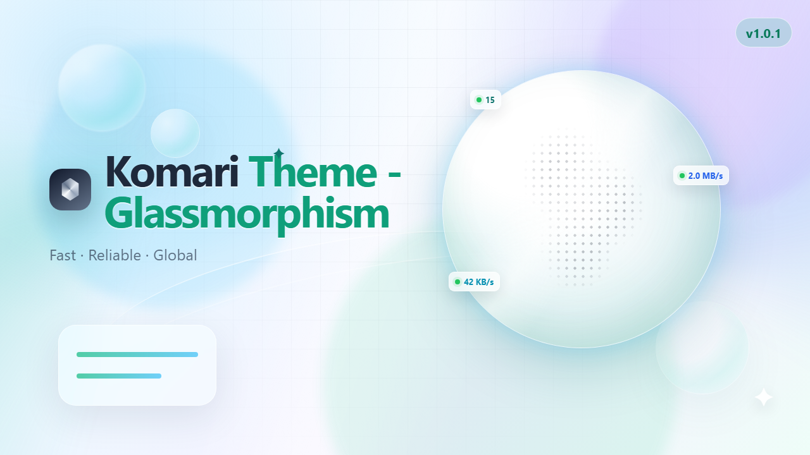

# Komari Nexus

A next-generation Komari theme based on
[komari-theme-Glassmorphism](https://github.com/sanrokamlan-prog/komari-theme-Glassmorphism) by sanrokamlan-prog.

Komari Nexus（Komari 星枢）把 Komari 节点监控与个人服务入口组织在同一个毛玻璃控制台中。它是可直接导入 Komari 的独立主题，不包含额外后端、数据库、服务探测或 Docker 自动发现。



## 功能

- 保留 Komari 实时节点、Metric Store / legacy 历史数据和旋转地球；默认使用轻量 cobe，高清地球按需加载。
- 展示主机在线、CPU、内存、存储和网络五项全局指标。
- 桌面每页展示 3 个完整探针，移动端每页展示 2 个完整探针。
- 探针包含在线天数、价格、流量比例、延迟/丢包历史与节点服务入口。
- 服务支持分组、排序、Iconify 在线图标检索、图标自动获取或本地上传、节点绑定和常用标记。
- 支持 AUTO / LAN / WAN 网络模式，地址缺失时自动回退到另一个地址。
- 登录后可管理 Nexus 设置，并使用拓扑、性价比、健康、导出和审计工具。
- 支持浅色、深色、自动主题、色觉辅助配色和 `prefers-reduced-motion`。

## 安装

1. 在 [Releases](https://github.com/Const-Time/komari-theme-nexus/releases) 下载 `komari-theme-nexus-build-*.zip`。
2. 登录 Komari 后台，进入主题管理并上传 ZIP。
3. 启用 `Komari Nexus`。

## 服务配置

服务配置保存在当前 Komari 主题的 `nexusConfig` 字段中。配置带版本号，解析失败时回退为空配置。

```json
{
  "version": 1,
  "groups": [
    { "id": "media", "name": "媒体", "order": 0, "enabled": true }
  ],
  "services": [
    {
      "id": "jellyfin",
      "name": "Jellyfin",
      "description": "家庭媒体库",
      "icon": "simple-icons:jellyfin",
      "groupId": "media",
      "nodeUuid": "Komari 节点 UUID",
      "lanUrl": "http://192.168.1.20:8096",
      "wanUrl": "https://media.example.com",
      "featured": true,
      "enabled": true,
      "order": 0
    }
  ]
}
```

图标可以使用 Iconify 名称或 HTTP(S) 图片地址。设置页可直接搜索并选择 Iconify 在线图标，也可自动获取 favicon，或上传 SVG、PNG、JPG、WebP、GIF、ICO；上传图片会在浏览器内清理并压缩后保存。

## 网络模式

- `AUTO`：先匹配 WAN 规则，再匹配 LAN 规则；未命中时使用 WAN。
- `LAN`：优先打开 `lanUrl`，为空时回退到 `wanUrl`。
- `WAN`：优先打开 `wanUrl`，为空时回退到 `lanUrl`。
- 手动网络模式、服务分组、探针页码和轮播偏好保存在当前浏览器。

## 数据与安全

- 首页和节点详情保持公开；私有站点由 Komari 登录页接管。
- Nexus 设置和高级工具在操作前验证管理员会话。
- Ping 优先使用 Metric Store 的 `ping.latency_ms` / `ping.loss`，旧核心自动回退 records。
- 快照 CSV 内置公式注入防护，托管 Markdown 限制不安全 URL scheme。
- 访客审计仅在核心明确提供并开启 `visitor_audit_enabled` 时启用。
- 服务卡片只提供导航，不执行 HTTP/TCP 健康检查。
- 服务配置限制为 32 个分组、64 个服务和 512 KB；地址只接受完整 HTTP(S) URL。

## 本地开发

要求 Bun `>=1.2.0`，从仓库根目录执行：

```bash
bun install --frozen-lockfile
bun run dev
bun run lint
bun run build
```

`bun run build` 会生成：

```text
dist/
komari-theme-nexus-build-<short-sha>.zip
```

ZIP 顶层固定包含 `komari-theme.json`、`preview.png` 和 `dist/`。

## Upstream

本项目基于 [sanrokamlan-prog/komari-theme-Glassmorphism](https://github.com/sanrokamlan-prog/komari-theme-Glassmorphism) 二次开发，并保留原作者署名与 MIT License。

## License

[MIT](LICENSE)
